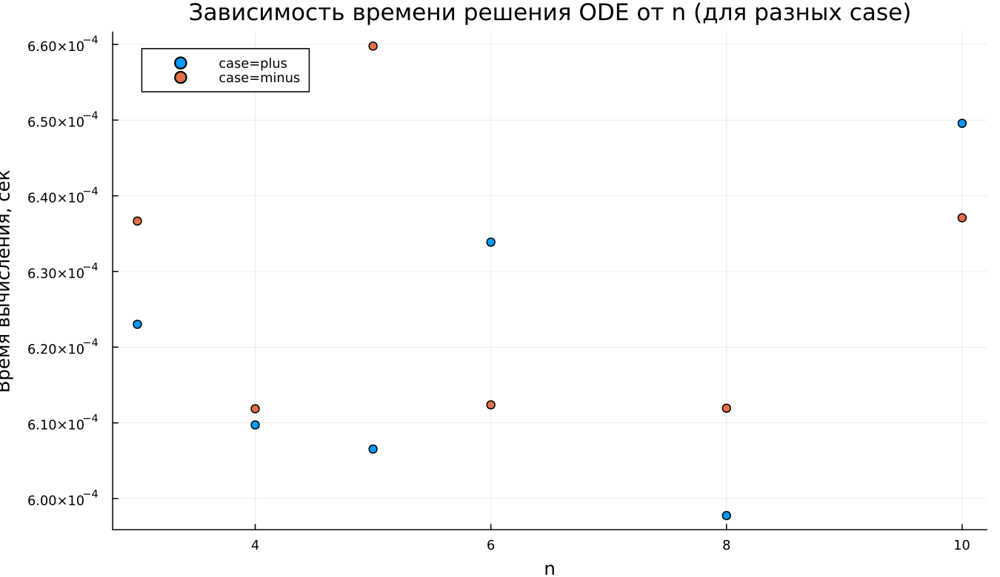

---
## Author
author:
  name: Суннатилло Махмудов
  email: 1132224173@rudn.ru
  affiliation:
    - name: Российский университет дружбы народов
      country: Российская Федерация
      postal-code: 117198
      city: Москва
      address: ул. Миклухо-Маклая, д. 6

## Title
title: "Математическое моделирование"
subtitle: "Лабораторная работа № 2"
license: "CC BY"
date: today
date-format: "YYYY-MM-DD"
---

# Вводная часть

## Цель работы

Рассмотреть пример построения математической модели для выбора стратегии поиска и преследования.

Сюжет задачи: в тумане катер береговой охраны преследует лодку браконьеров. После краткого прояснения лодка обнаруживается на расстоянии $k$ км от катера, затем снова исчезает и уходит прямолинейно в неизвестном направлении. Скорость катера в $n$ раз больше скорости лодки. Требуется определить траекторию катера, гарантирующую перехват.

## Задание

1. Провести рассуждения и вывести дифференциальные уравнения для случая, когда скорость катера больше скорости лодки в $n$ раз.
2. Построить траектории движения катера и лодки для двух случаев начальных условий.
3. Определить по графику точку пересечения траекторий (момент перехвата).

# Теория: постановка и вывод модели

## Начальные обозначения и координаты

Положим $t_0 = 0$.

В момент обнаружения:

- лодка находится в точке $X_0 = 0$,
- катер находится на расстоянии $k$: $X_0 = k$ относительно лодки.

Переходим к полярным координатам:

- полюс — точка обнаружения лодки,
- ось $r$ проходит через начальное положение катера.

## Дистанция перехода к «обходу» полюса

Ищем расстояние $x$, при котором катер и лодка окажутся на одинаковом расстоянии от полюса.

За время $t$ лодка проходит $x$, катер — $x-k$ или $x+k$ (в зависимости от начальной конфигурации).

## Разложение скорости катера и система ОДУ

Из равенства времён получаем два режима:

- **case = plus**:
  $$
  x_1=\frac{k}{n+1}, \quad \theta_0=0
  $$
- **case = minus**:
  $$
  x_2=\frac{k}{n-1}, \quad \theta_0=-\pi
  $$

## Уравнение траектории катера

Исключая $t$:
$$
\frac{dr}{d\theta}=\frac{r}{\sqrt{n^2-1}}.
$$

Из этого следует качественный вид траектории: экспоненциально расходящаяся спираль в полярных координатах.

# Эксперимент: численное моделирование

## Условие задачи для расчётов

Дано:

- расстояние обнаружения: $k=20$ км,
- скорость катера выше в $n=5$ раз.

Цель: построить траектории катера и лодки, определить точку перехвата по пересечению кривых.

## Базовый эксперимент: case = plus

## Базовый эксперимент: case = plus

Наблюдения:

- траектория катера — расходящаяся спираль;
- радиус $r$ монотонно растёт при увеличении угла $\theta$;
- лодка в полярных координатах выглядит как луч (прямолинейное движение в декартовых координатах).

## Базовый эксперимент: case = minus

## Базовый эксперимент: case = minus

Отличие от case=plus:

- стартовый радиус больше, поэтому спираль смещена наружу;
- качественная форма траектории сохраняется, меняется масштаб.

# Параметрический анализ

## Сканирование по параметру $n$

## Сканирование по параметру $n$

Из уравнения:
$$
\frac{dr}{d\theta}=\frac{r}{\sqrt{n^2-1}}
$$

коэффициент роста по углу равен $1/\sqrt{n^2-1}$, поэтому:

- при малых $n$ спираль расходится быстрее;
- при больших $n$ рост радиуса замедляется;
- траектории становятся более «пологими».

## Метрика scale_ratio

Определим:
$$
\text{scale\_ratio}=\frac{r_{\text{final}}}{\max(r_{\text{boat}})}.
$$

## Метрика scale_ratio

## Метрика scale_ratio

Интерпретация:

- при малых $n$ метрика заметно больше 1 — катер сильно «переразгоняет» лодку по радиусу;
- с ростом $n$ значение быстро падает;
- для больших $n$ масштабы траекторий становятся сопоставимыми.

Для режима case=minus значения выше из-за большего стартового радиуса.

## Время вычислений

## Время вычислений

Результаты бенчмаркинга:

- время расчёта порядка $\sim 6\times10^{-4}$ сек;
- заметной зависимости от $n$ нет;
- небольшие колебания обусловлены адаптивным шагом интегрирования.

# Итоги

## Выводы

1. Траектория катера в полярных координатах — экспоненциально расходящаяся спираль.
2. Параметр $n$ регулирует скорость радиального роста: чем больше $n$, тем медленнее растёт радиус при увеличении $\theta$.
3. Начальное условие (режим case) меняет масштаб траектории, но не её качественный вид.
4. Численное решение устойчиво, а вычислительные затраты практически не зависят от $n$.

