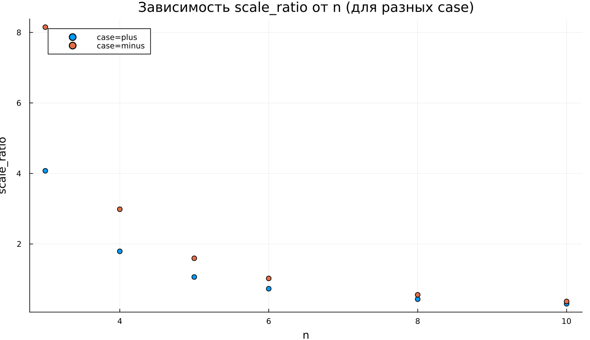

---
## Author
author:
  name: Суннатилло Махмудов
  email: 1132224173@rudn.ru
  affiliation:
    - name: Российский университет дружбы народов
      country: Российская Федерация
      postal-code: 117198
      city: Москва
      address: ул. Миклухо-Маклая, д. 6

## Title
title: "Математическое моделирование"
subtitle: "Лабораторная работа № 2"
license: "CC BY"
---

# Цель работы

Приведем один из примеров построения математических моделей для выбора правильной стратегии при решении задач поиска. 
Например, рассмотрим задачу преследования браконьеров береговой охраной. На море в тумане катер береговой охраны преследует лодку браконьеров. Через определенный промежуток времени туман рассеивается, и лодка обнаруживается на расстоянии k км от катера. Затем лодка снова скрывается в тумане и уходит прямолинейно в неизвестном направлении. Известно, что скорость катера в n раза больше скорости браконьерской лодки. 
Необходимо определить по какой траектории необходимо двигаться катеру, чтоб нагнать лодку.

# Задание

1. Провести необходимые рассуждения и вывод дифференциальных уравнений, если скорость катера больше скорости лодки в n раз.
2. Построить траекторию движения катера и лодки для двух случаев. 
3. Определить по графику точку пересечения катера и лодки.

# Выполнение лабораторной работы

Принимаем за $t_0=0, X_0=0$  - место нахождения лодки браконьеров в момент обнаружения, $X_0=k$   - место нахождения катера береговой охраны относительно лодки браконьеров в момент обнаружения лодки.

Введем полярные координаты. Считаем, что полюс - это точка обнаружения лодки браконьеров $x_0=0 (\theta=x_0=0)$, а полярная ось r проходит через точку нахождения катера береговой охраны.

Чтобы найти расстояние $x$ (расстояние после которого катер начнет двигаться вокруг полюса), необходимо составить простое уравнение. Пусть через время $t$ катер и лодка окажутся на одном расстоянии $x$ от полюса. За это время лодка пройдет $x$, а катер $x-k$ (или $x+k$, в зависимости от начального положения катера относительно полюса). Время, за которое они пройдут это расстояние, вычисляется как $\frac{x}{υ}$ или $\frac{x+k}{υ}$ (для второго случая $\frac{x-k}{υ}$).  Так как время одно и то же, то эти величины одинаковы. Тогда неизвестное расстояние можно найти из следующего уравнения:  $\frac{x}{υ} = \frac{x+k}{υ}$ - в первом случае, $\frac{x}{υ} =  \frac{x-k}{υ}$ во втором случае.

Отсюда мы найдем два значения $x_1$ и $x_2$, задачу будем решать для двух случаев. 

$x_1=\frac{k}{n+1}$ ,при $\theta=0$

$x_2=\frac{k}{n-1}$ ,при $\theta=-\pi$

После того, как катер береговой охраны окажется на одном расстоянии от полюса, что и лодка, он должен сменить прямолинейную траекторию и начать двигаться вокруг полюса удаляясь от него со скоростью лодки $υ$. Для этого скорость катера раскладываем на две составляющие: $υ_r$ - радиальная скорость и $υ_t$- тангенциальная скорость. Радиальная скорость - это скорость, с которой катер удаляется от полюса $υ_r=\frac{dr}{dt}$. Нам нужно, чтобы эта скорость была равна скорости лодки, поэтому полагаем $υ=\frac{dr}{dt}$.
Тангенциальная скорость – это линейная скорость вращения катера относительно полюса. Она равна произведению угловой скорости $\frac{d\theta}{dt}$  на радиус $r$, $υr=r\frac{d\theta}{dt}$
Найдем тангенциальную скорость для нашей задачи $υ_t=r\frac{d\theta}{dt}$.
Вектора образуют прямоугольный треугольник, откуда по теореме Пифагора можно найти тангенциальную скорость $υ_t= \sqrt{n^2 υ_r^2-v^2}$. Поскольку, радиальная скорость равна $υ$, то тангенциальную скорость находим из уравнения $υ_t= \sqrt{n^2 υ^2-υ^2 }$. Следовательно, $υ_τ=υ\sqrt{n^2-1}$.

Тогда получаем $r\frac{d\theta}{dt}=υ\sqrt{n^2-1}$

Решение исходной задачи сводится к решению системы из двух дифференциальных уравнений 

$$
 \begin{cases}
   \frac{dr}{dt}=υ
	\\   
	r\frac{d\theta}{dt}=υ\sqrt{n^2-1}
 \end{cases}
$$

с начальными условиями

$$
 \begin{cases}
   \theta_0=0
   \\
	r_0=\frac{k}{n+1}
 \end{cases}
\
$$

$$
 \begin{cases}
   \theta_0=-\pi
   \\
	r_0=\frac{k}{n-1}
 \end{cases}
\
$$

Исключая из полученной системы производную по t, можно перейти к следующему уравнению: $\frac{dr}{d\theta}=\frac{r}{\sqrt{n^2-1}}$

Начальные условия остаются прежними. Решив это уравнение, мы получим
траекторию движения катера в полярных координатах. 
Теперь, когда нам известно все, что нам нужно, построим траекторию движения катера и лодки для двух случаев. 

## Условие задачи

На море в тумане катер береговой охраны преследует лодку браконьеров.
Через определенный промежуток времени туман рассеивается, и лодка обнаруживается на расстоянии 20 км от катера. 
Затем лодка снова скрывается в тумане и уходит прямолинейно в неизвестном направлении. 
Известно, что скорость катера в 5 раза больше скорости браконьерской лодки

Для моделирования процесса и построения графиков использовались внешние файлы с программным кодом:





## Анализ результатов моделирования

В ходе работы было проведено численное исследование движения катера, описываемого дифференциальным уравнением

$$
\frac{dr}{d\theta} = \frac{r}{\sqrt{n^2 - 1}},
$$

а также выполнено сравнение его траектории с траекторией лодки, заданной аналитически и переведённой в полярные координаты.

## Базовые эксперименты

### 1. Случай (case = plus)

На полярном графике видно, что траектория катера имеет вид расходящейся спирали. Радиус монотонно увеличивается при росте угла $ \theta $, причём скорость увеличения возрастает по мере удаления от центра. Это объясняется тем, что производная $ dr/d\theta $ пропорциональна самому радиусу $ r $, следовательно, рост носит экспоненциальный характер по углу.

Траектория лодки представляет собой луч, соответствующий прямолинейному движению в декартовой системе координат. В полярной системе она выражается линейной зависимостью радиуса от параметра движения.

Катер постепенно удаляется от центра быстрее, чем лодка, что видно по увеличивающемуся расстоянию между кривыми.

### 2. Случай (case = minus)

Во втором базовом эксперименте начальный радиус больше, поэтому катер стартует дальше от полюса. Спираль сохраняет тот же характер роста, однако вся траектория масштабирована наружу.

Различие между режимами case=plus и case=minus проявляется именно в начальном положении и общем масштабе кривой, тогда как форма роста остаётся одинаковой.

## Параметрическое сканирование по $n$

Было исследовано влияние параметра $n$ на динамику системы для обоих режимов начального условия.

Из уравнения следует, что коэффициент роста равен $$ 1/\sqrt{n^2-1} $$. При увеличении $n$ этот коэффициент уменьшается, следовательно:

- при малых $n$ спираль расходится быстрее;
- при больших $n$ рост радиуса замедляется;
- траектории становятся более «пологими».

На графике чётко видно, что для $ n=3 $ наблюдается наиболее быстрый рост, а для $ n=10 $ — самый медленный.

## Анализ метрики scale_ratio

Введённая метрика

$$
\text{scale\_ratio} = \frac{r_{\text{final}}}{\max(r_{\text{boat}})}
$$

характеризует относительный масштаб траектории катера по сравнению с лодкой.

График показывает:

- при малых $n$ значение метрики значительно больше единицы — катер существенно опережает лодку по радиальному росту;
- при увеличении $n$ значение резко уменьшается;
- для больших $n$ траектории становятся сопоставимыми по масштабу.

Для режима case=minus значения метрики выше, поскольку начальный радиус больше.

## Время вычислений

Был выполнен бенчмаркинг решения ОДУ при различных значениях $n$.

Из графика видно:

- время вычисления находится в пределах $\sim 6 \times 10^{-4}$ секунды;
- существенной зависимости от параметра $n$ не наблюдается;
- небольшие колебания связаны с особенностями адаптивного шага интегрирования и численной обработки.

# Выводы

1. Траектория катера в полярных координатах представляет собой экспоненциально расходящуюся спираль.
2. Параметр $n$ управляет скоростью радиального роста: чем больше $n$, тем медленнее увеличивается радиус.
3. Начальное условие (case) определяет масштаб траектории, но не меняет её качественный характер.
4. Численная устойчивость метода высокая, а вычислительные затраты практически не зависят от параметров модели.

Полученные результаты полностью согласуются с аналитической структурой исходного дифференциального уравнения.

# Список литературы {.unnumbered}

1. [Задача о погоне](https://esystem.rudn.ru/pluginfile.php/2290141/mod_resource/content/2/Лабораторная%20работа%20№%201.pdf)

