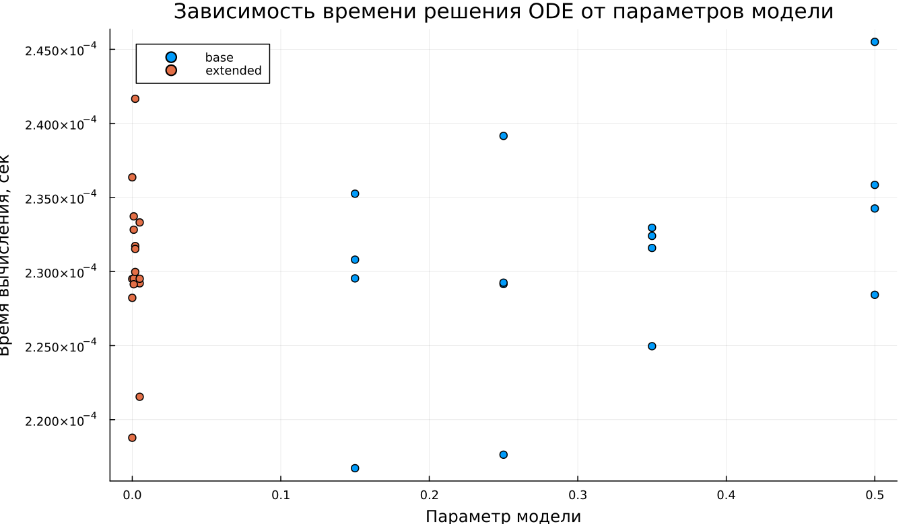

---
## Author
author:
  name: Суннатилло Махмудов
  email: 1132224173@rudn.ru
  affiliation:
    - name: Российский университет дружбы народов
      country: Российская Федерация
      postal-code: 117198
      city: Москва
      address: ул. Миклухо-Маклая, д. 6

## Title
title: "Математическое моделирование"
subtitle: "Лабораторная работа № 5"
license: "CC BY"
---

# Цель работы

Изучить модель хищник-жертва

# Задание

1.	Построить график зависимости $x$ от $y$ и графики функций $x(t)$, $y(t)$
2.	Найти стационарное состояние системы

# Выполнение лабораторной работы

## Теоретические сведения

В данной лабораторной работе рассматривается математическая модель системы «Хищник-жертва». 

Рассмотрим базисные компоненты системы. 
Пусть система имеет $X$ хищников и $Y$ жертв. И пусть для этой системы выполняются следующие предположения: (Модель Лотки-Вольтерра)
1.	Численность популяции жертв и хищников зависят только от времени (модель не учитывает пространственное распределение популяции на занимаемой территории) 
2.	В отсутствии взаимодействия численность видов изменяется по модели Мальтуса, при этом число жертв увеличивается, а число хищников падает 
3.	Естественная смертность жертвы и естественная рождаемость хищника считаются несущественными 
4.	Эффект насыщения численности обеих популяций не учитывается 
5.	Скорость роста численности жертв уменьшается пропорционально численности хищников:

$$
 \begin{cases}
	\frac{dx}{dt} = (-ax(t) + by(t)x(t))
	\\   
	\frac{dy}{dt} = (cy(t) - dy(t)x(t))
 \end{cases}
$$

Параметр $a$ определяет коэффициент смертности хищников, $b$ – коэффициент естественного прироста хищников, $c$ – коэффициент прироста жертв и $d$ – коэффициент смертности жертв

В зависимости от этих параметрах система и будет изменяться. Однако следует выделить одно важное состояние системы, при котором не происходит никаких изменений как со стороны хищников, так и со стороны жертв. Это, так называемое, стационарное состояние системы. При нем, как уже было отмечено, изменение численности популяции равно нулю.
Следовательно, при отсутствии изменений в системе $\frac{dx}{dt} = 0, \frac{dy}{dt} = 0$

Пусть по условию есть хотя бы один хищник и хотя бы одна жертва: $x>0, y>0$
Тогда стационарное состояние системы определяется следующим образом: 
$$
	x_0=\frac{a}{b}, y_0=\frac{c}{d}
$$

## Задача

Для модели «хищник-жертва»:

$$
 \begin{cases}
	\frac{dx}{dt} = -0.25x(t) + 0.025y(t)x(t)
	\\   
	\frac{dy}{dt} = 0.45y(t) - 0.045y(t)x(t)
 \end{cases}
$$

Постройте график зависимости численности хищников от численности жертв, а также графики изменения численности хищников и численности жертв 
при следующих начальных условиях: $x_0=8, y_0=11$
Найдите стационарное состояние системы

Стационарное состояние $x_0=\frac{a}{b}=10, y_0=\frac{c}{d}=10$

Для моделирования процесса и построения графиков использовались внешние файлы с программным кодом:





## Базовые эксперименты

### Базовая модель (model_type = base)

Для базовой модели на графиках временных зависимостей наблюдаются устойчивые периодические колебания обеих переменных. Численности жертв $x(t)$ и хищников $y(t)$ изменяются во времени регулярно, причём амплитуда колебаний на всём интервале остаётся практически постоянной.

Такое поведение соответствует классической колебательной динамике системы хищник–жертва без затухания. Популяции не переходят к стационарному состоянию и не демонстрируют затухания амплитуды, а продолжают совершать повторяющиеся колебания около некоторого среднего уровня.

Фазовый портрет базовой модели имеет вид замкнутой овальной траектории. Это подтверждает периодический характер движения: система многократно возвращается в те же фазовые состояния, а траектория остаётся ограниченной.

### Расширенная модель (model_type = extended)

В расширенной модели также наблюдается колебательный процесс, однако его характер существенно отличается от базового случая. На графиках $x(t)$ и $y(t)$ видно, что в начале движения амплитуда колебаний достаточно велика, но затем постепенно уменьшается.

Это связано с появлением дополнительного нелинейного члена $-k x^2$, который ограничивает рост популяции жертв. В результате система теряет исходную консервативность, и колебания становятся затухающими по амплитуде. Со временем решение стремится не к нулю, а к некоторому устойчивому стационарному режиму.

Фазовый портрет расширенной модели подтверждает этот вывод. Траектория имеет вид закручивающейся спирали, которая постепенно стягивается к внутренней области фазового пространства. Это означает, что после переходного процесса система приближается к устойчивому состоянию равновесия.

Следовательно, расширенная модель демонстрирует затухающие колебания с выходом на стационарное состояние. Дополнительный нелинейный механизм стабилизирует динамику и подавляет незатухающие циклы, характерные для базовой модели.

## Параметрическое сканирование

### Траектории $x(t)$ для различных параметров

Было проведено параметрическое исследование двух моделей. Для базовой модели варьировался параметр $a$, а для расширенной — параметр $k$, отвечающий за дополнительное ограничение роста популяции жертв.

Для базовой модели изменение параметра $a$ влияет прежде всего на характер периодических колебаний. При разных значениях параметра изменяются амплитуда и частота колебаний, однако общий режим остаётся колебательным: траектории не затухают и сохраняют выраженную периодичность на всём временном интервале.

Для расширенной модели изменение параметра $k$ существенно влияет на скорость затухания и уровень, к которому стремится решение. При увеличении $k$ вклад нелинейного ограничения усиливается, вследствие чего колебания быстрее подавляются, а переход к стационарному режиму происходит более заметно.

Основные наблюдения:

- базовая модель сохраняет устойчивый колебательный режим;
- расширенная модель демонстрирует затухание колебаний;
- параметры влияют на амплитуду, частоту и скорость установления решения.

### Траектории $y(t)$ для различных параметров

Анализ траекторий $y(t)$ показывает аналогичные закономерности. Для базовой модели переменная сохраняет регулярные периодические колебания, причём изменение параметра $a$ приводит к изменению формы и масштаба этих колебаний, но не разрушает сам периодический режим.

В расширенной модели семейство кривых демонстрирует постепенное уменьшение амплитуды и выход на различные стационарные уровни. Чем сильнее нелинейное ограничение, тем быстрее исчезают большие колебания и тем быстрее система приближается к устойчивому состоянию.

### Фазовые траектории для различных параметров

Сравнение фазовых траекторий позволяет наглядно увидеть различие в структуре динамики при разных параметрах и для разных типов модели.

Для базовой модели фазовые траектории в основном представляют собой замкнутые кривые различного размера и формы. Это указывает на сохранение периодического режима и отсутствие стремления к единственной точке равновесия.

Для расширенной модели фазовые траектории имеют спиралевидный характер и постепенно стягиваются к внутренним областям фазового пространства. Такое поведение соответствует затухающим колебаниям и наличию устойчивого состояния, к которому стремится система после переходного процесса.

Следовательно, фазовые портреты подтверждают, что параметрическое изменение коэффициентов не меняет фундаментальную природу моделей: базовая система остаётся автоколебательной, а расширенная — стабилизирующейся.

## Анализ метрики norm_final

Рассматривалась метрика

$$
\text{norm\_final} = \sqrt{x(t_{final})^2 + y(t_{final})^2}.
$$

Полученные результаты показывают, что для базовой модели значение $\text{norm\_final}$ остаётся сравнительно большим и заметно зависит от параметра $a$. Это связано с тем, что к моменту окончания интегрирования система продолжает находиться в колебательном режиме и не переходит к стационарному состоянию.

Для расширенной модели значения метрики также зависят от параметра $k$, однако их интерпретация иная. Здесь величина $\text{norm\_final}$ определяется уже не фазой незатухающего цикла, а положением устойчивого состояния, к которому система приближается после затухания переходных колебаний.

## Время вычислений

Бенчмаркинг показывает, что время численного решения во всех экспериментах остаётся очень малым и имеет один порядок величины. Это свидетельствует о хорошей вычислительной эффективности используемой схемы интегрирования для обеих моделей.

Для базовой модели наблюдается небольшой разброс времени вычисления при изменении параметра $a$. Для расширенной модели время также меняется несущественно при варьировании параметра $k$.

Можно отметить, что расширение модели дополнительным нелинейным членом не приводит к резкому росту вычислительных затрат. Следовательно, усложнение структуры системы практически не ухудшает её численную разрешимость на выбранном интервале времени.

## Выводы

1. Базовая модель демонстрирует устойчивые незатухающие периодические колебания.
2. Расширенная модель характеризуется затухающими колебаниями и выходом на стационарное состояние.
3. Фазовые портреты подтверждают различие между замкнутыми периодическими траекториями базовой модели и спиральным стягиванием в расширенной модели.
4. Параметры $a$ и $k$ влияют на амплитуду, частоту и скорость установления решения.
5. Метрика $\text{norm\_final}$ отражает качественное различие между незатухающим и стабилизирующимся режимами.
6. Обе модели эффективно вычисляются численно, а увеличение сложности системы не приводит к существенному росту времени расчёта.

# Список литературы {.unnumbered}

1. [Модель Лотки-Вольтерры](https://math-it.petrsu.ru/users/semenova/MathECO/Lections/Lotka_Volterra.pdf)
2. [Lotka-Volterra System](https://www.sciencedirect.com/topics/mathematics/lotka-volterra-system)
